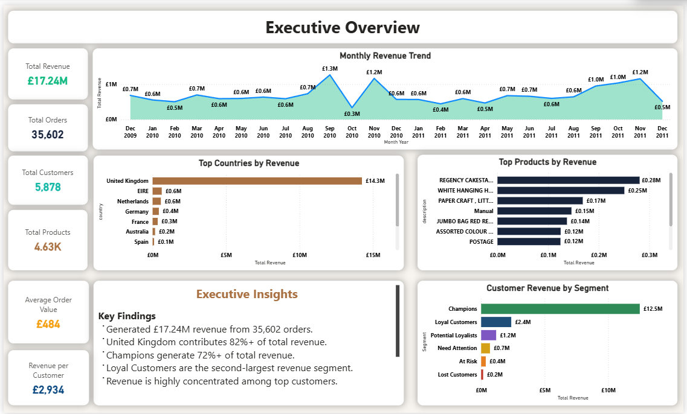
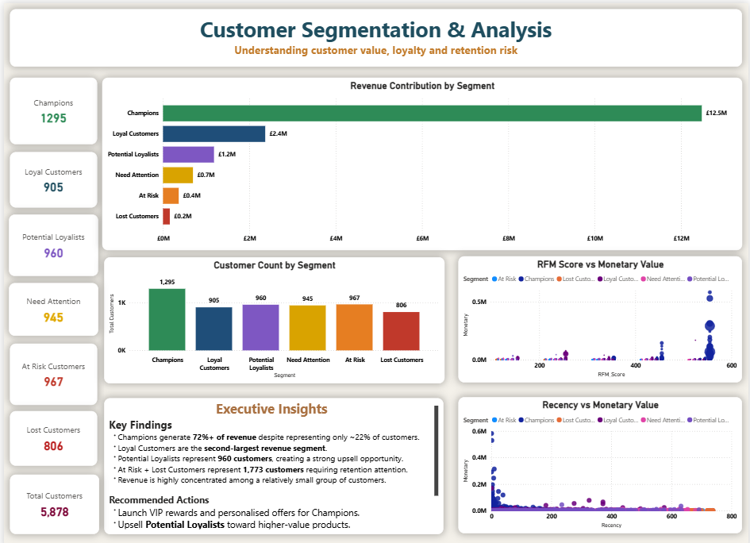
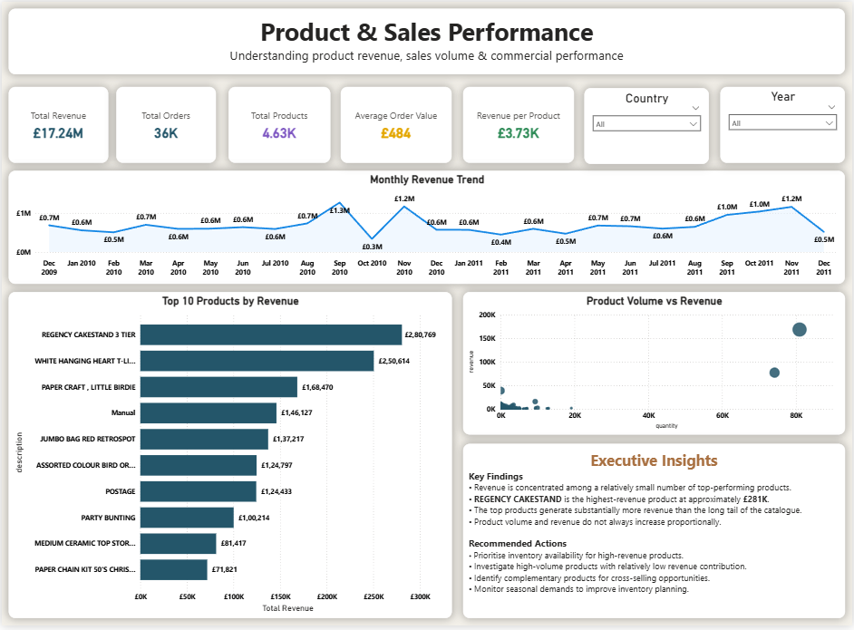
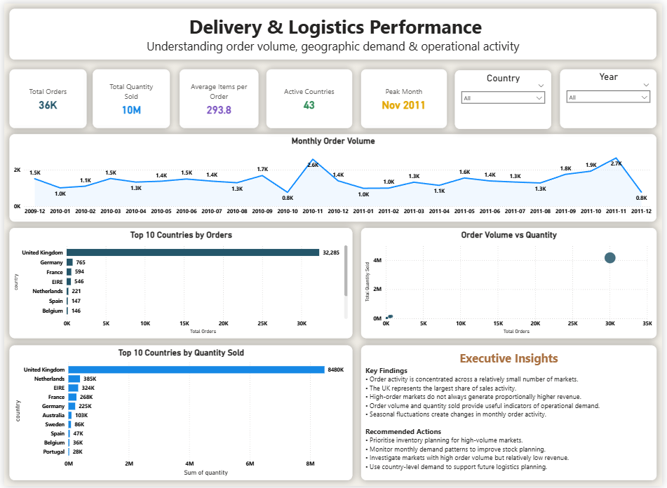
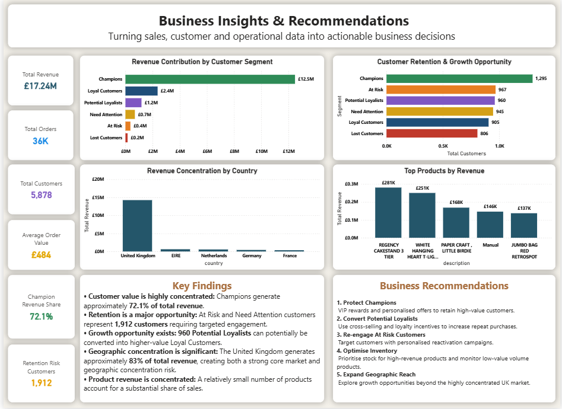

# 🛍️ Retail Sales Analytics | Power BI

<p align="center">


</p>

<p align="center">


</p>

<p align="center">

<strong>Turning transactional retail data into business decisions.</strong>

</p>

<p align="center">
<b>SQL</b> • <b>Python</b> • <b>PostgreSQL</b> • <b>RFM Analysis</b> • <b>Power BI</b> • <b>DAX</b> • <b>Business Intelligence</b>
</p>

---

## 📌 Project Overview

**Retail Sales Analytics** is an end-to-end data analytics and business intelligence project designed to transform transactional retail data into actionable commercial insights.

The project combines **Python-based exploratory analysis, PostgreSQL data modelling and SQL analysis, RFM customer segmentation, and Power BI dashboard development** to answer practical business questions around:

* 📈 Sales performance
* 👥 Customer value and retention
* 🛍️ Product performance
* 🌍 Geographic concentration
* 🚚 Order and operational activity
* 💡 Business opportunities and recommendations

The objective is not simply to build charts, but to answer:

> **What is happening in the business, why does it matter, and what should management do next?**

---

## 🎯 Business Objectives

This project was developed to help a retail business understand:

| Business Area | Key Question                                |
| ------------- | ------------------------------------------- |
| 💰 Revenue    | How is revenue performing over time?        |
| 🛒 Orders     | Where is order activity concentrated?       |
| 👥 Customers  | Which customers create the most value?      |
| 🎯 Retention  | Which customers require attention?          |
| 🛍️ Products  | Which products contribute the most revenue? |
| 🌍 Geography  | Which markets drive sales?                  |
| 📦 Operations | Where is demand concentrated?               |
| 💡 Strategy   | What actions should management prioritise?  |

---

# 📊 Dashboard Preview

## 01 — Executive Overview



Provides a high-level view of:

* Total Revenue
* Total Orders
* Total Customers
* Total Products
* Average Order Value
* Monthly Revenue
* Country Performance
* Product Performance

---

## 02 — Customer Segmentation & RFM Analysis



Customers are segmented using **RFM analysis** into:

* 🟢 Champions
* 🔵 Loyal Customers
* 🟣 Potential Loyalists
* 🟡 Need Attention
* 🟠 At Risk
* 🔴 Lost Customers

This enables the business to distinguish between high-value customers, growth opportunities and retention risks.

---

## 03 — Product & Sales Performance



Analyses:

* Monthly revenue trends
* Top products by revenue
* Product volume
* Revenue contribution
* Product performance
* Volume vs revenue relationships

---

## 04 — Delivery & Logistics Performance



Focuses on operational demand rather than unsupported delivery-time metrics:

* Monthly order volume
* Quantity sold
* Average items per order
* Country-level demand
* Order volume vs quantity
* Operational activity

> **Data limitation:** The available transactional dataset does not contain shipment, delivery or promised-delivery timestamps. Therefore, this page focuses on order and geographic demand rather than claiming actual delivery-time performance.

---

## 05 — Business Insights & Recommendations



The final page converts analytical findings into business actions across:

* Customer retention
* Customer growth
* Product strategy
* Inventory planning
* Geographic expansion

---

# 📈 Project Snapshot

| KPI                         |       Result |
| --------------------------- | -----------: |
| 💰 Total Revenue            | **£17.24M** |
| 🛒 Total Orders             |   **36,969** |
| 👥 Total Customers          |    **5,878** |
| 🛍️ Total Products          |    **4,631** |
| 🌍 Active Countries         |       **43** |
| 🎯 Customer Segments        |        **6** |
| 🟢 Champion Customers       |    **1,295** |
| 🟣 Potential Loyalists      |      **960** |
| 🟠 At Risk Customers        |      **967** |
| 🔴 Lost Customers           |      **806** |
| ⚠️ Retention Risk Customers |    **1,912** |
| 🏆 Champion Revenue Share   |    **72.1%** |


---

# 🔥 Key Business Insights

### 🏆 1. Champions Drive the Business

**1,295 Champion customers generate approximately 72.1% of total revenue.**

This indicates a highly concentrated customer-value structure.

**Business implication:** protecting high-value customers should be a major retention priority.

---

### ⚠️ 2. Retention Risk Is Significant

**1,912 customers** fall into:

* At Risk
* Need Attention

These customers represent an opportunity to prevent future revenue loss.

**Business implication:** targeted reactivation campaigns should prioritise customers showing declining recency or engagement.

---

### 🚀 3. Potential Loyalists Represent Growth

There are **960 Potential Loyalists**.

These customers have demonstrated purchasing behaviour that could potentially be developed into stronger long-term relationships.

**Business implication:** personalised recommendations, cross-selling and loyalty incentives could increase customer lifetime value.

---

### 🇬🇧 4. Revenue Is Highly Concentrated Geographically

The **United Kingdom** is overwhelmingly the largest revenue market.

**Business implication:** the UK represents a strong core market, but the concentration also creates geographic dependency risk.

---

### 🛍️ 5. Product Revenue Is Concentrated

A relatively small group of products contributes a significant share of product revenue.

The leading product is:

**REGENCY CAKESTAND 3 TIER**

with approximately **£281K** in revenue.

**Business implication:** inventory and promotional planning should prioritise high-value products while monitoring high-volume, lower-value products separately.

---

# 💡 Business Recommendations

## 🟢 1. Protect Champions

Develop a high-value customer strategy:

* VIP rewards
* Personalised offers
* Early access to products
* Loyalty incentives
* Priority customer engagement

**Goal:** protect the customer group responsible for the majority of revenue.

---

## 🟣 2. Convert Potential Loyalists

Create targeted growth campaigns:

* Cross-selling
* Product recommendations
* Loyalty programme incentives
* Repeat-purchase offers
* Personalised promotions

**Goal:** move Potential Loyalists toward Loyal Customer status.

---

## 🟠 3. Re-engage At Risk Customers

Use RFM-driven retention campaigns:

* Personalised reactivation offers
* Recency-based targeting
* Limited-time incentives
* Customer-specific product recommendations

**Goal:** reduce future customer loss.

---

## 🔵 4. Optimise Inventory

Use product-level demand and revenue analysis to:

* Prioritise high-revenue products
* Monitor high-volume/low-value products
* Identify slow-moving inventory
* Support demand planning

**Goal:** improve inventory efficiency and reduce avoidable stock risk.

---

## 🟡 5. Expand Geographic Reach

The UK is the dominant market.

Potential strategy:

* Identify high-potential European markets
* Analyse country-level order behaviour
* Test targeted marketing campaigns
* Compare revenue and customer value by country

**Goal:** diversify revenue while protecting the UK core market.

---

# 🧠 RFM Methodology

RFM analysis evaluates customers using three behavioural dimensions:

| Metric        | Meaning                             |
| ------------- | ----------------------------------- |
| **Recency**   | How recently the customer purchased |
| **Frequency** | How often the customer purchased    |
| **Monetary**  | How much the customer spent         |

Customers were scored across the three dimensions and assigned to actionable segments.

### Segment Framework

```text
                HIGH VALUE
                    ▲
                    │
             🟢 Champions
                    │
          🔵 Loyal Customers
                    │
       🟣 Potential Loyalists
                    │
────────────────────┼────────────────────
                    │
          🟡 Need Attention
                    │
             🟠 At Risk
                    │
             🔴 Lost Customers
                    │
                    ▼
                LOW VALUE
```

---

# 🧱 End-to-End Data Pipeline

```text
Raw Retail Transaction Data
            │
            ▼
     Python / Pandas
            │
            ▼
   Data Cleaning & EDA
            │
            ▼
       PostgreSQL
            │
            ▼
      SQL Analysis
            │
            ▼
      RFM Analysis
            │
            ▼
 Customer Segmentation
            │
            ▼
    Power BI Data Model
            │
            ▼
       DAX Measures
            │
            ▼
   Interactive Dashboard
            │
            ▼
Business Insights & Actions
```

---

# 🧹 Data Preparation & Quality

The analytical workflow included:

* Data type validation
* Transaction-level validation
* Revenue validation
* Customer identifier checks
* Product identifier validation
* Duplicate record investigation
* Missing-value analysis
* Customer-level aggregation
* RFM feature engineering
* Customer segmentation
* SQL business validation

The project deliberately separates **data preparation**, **analytical modelling**, **visualisation**, and **business interpretation**.

---

# 🛠️ Technology Stack

<div align="center">

| Technology        | Purpose                                    |
| ----------------- | ------------------------------------------ |
| 🐍 **Python**     | Data cleaning, EDA and RFM analysis        |
| 🐘 **PostgreSQL** | Relational data storage and SQL analysis   |
| 🧮 **SQL**        | Business analysis and data validation      |
| 📊 **Power BI**   | Interactive dashboard and storytelling     |
| 📐 **DAX**        | Measures, KPIs and analytical calculations |
| 🐼 **Pandas**     | Data manipulation and analysis             |

</div>

---

# 📂 Repository Structure

```text
retail-sales-analytics-powerbi/
│
├── notebooks/
│   ├── retail_eda.ipynb
│   └── rfm_analysis.ipynb
│
├── sql/
│   ├── 01_create_tables.sql
│   ├── 02_data_cleaning.sql
│   ├── 03_data_validation.sql
│   ├── 04_business_analysis.sql
│   ├── 05_rfm_analysis.sql
│   └── 06_views.sql
│
├── powerbi/
│   └── Retail_Sales_Analytics.pbix
│
├── screenshots/
│   ├── executive_overview.png
│   ├── customer_segmentation.png
│   ├── product_sales_performance.png
│   ├── delivery_logistics.png
│   └── business_insights.png
│
├── LICENSE
└── README.md
```

> The repository structure above reflects the current project organisation. Additional documentation or data folders can be added as the project evolves.

---

# 📚 Analytical Workflow

### Phase 1 — Data Understanding

Understand the transaction structure, business context and available fields.

### Phase 2 — Data Preparation

Clean, validate and transform the transactional dataset.

### Phase 3 — Exploratory Data Analysis

Identify revenue, customer, product and geographic patterns.

### Phase 4 — RFM Analysis

Calculate:

* Recency
* Frequency
* Monetary value

### Phase 5 — Customer Segmentation

Translate RFM scores into actionable customer groups.

### Phase 6 — SQL Business Analysis

Create reusable analytical queries and views.

### Phase 7 — Power BI Modelling

Build relationships, calculated measures and KPI logic.

### Phase 8 — Dashboard Development

Create five analytical pages plus a project cover page.

### Phase 9 — Business Storytelling

Convert analytical findings into recommendations and commercial actions.

---

# 🎯 Business Questions Answered

* What is the overall revenue and order performance?
* Which customers generate the most value?
* Which customer segments require attention?
* Which customers represent growth opportunities?
* Which products generate the most revenue?
* Which countries drive sales?
* Where is revenue geographically concentrated?
* How does order volume vary over time?
* Where is product demand concentrated?
* What should management prioritise?

---

# 📊 Dashboard Pages

| #  | Page                                    | Purpose                        |
| -- | --------------------------------------- | ------------------------------ |
| 01 | **Executive Overview**                  | Overall commercial performance |
| 02 | **Customer Segmentation & RFM**         | Customer value and retention   |
| 03 | **Product & Sales Performance**         | Product and revenue analysis   |
| 04 | **Delivery & Logistics Performance**    | Order and geographic demand    |
| 05 | **Business Insights & Recommendations** | Strategic decision-making      |

---

# 👤 Author

## Yash Prajapati

**Aspiring Data Analyst | SQL | Python | Power BI | PostgreSQL | Business Intelligence**

I build end-to-end analytics projects that combine **data preparation, SQL analysis, statistical/customer analysis, dashboard development and business storytelling**.

### 🔗 Connect

<p align="center">

<a href="https://github.com/YashPrajapati989">

</a>

<a href="https://www.linkedin.com/">

</a>

</p>

---

# ⭐ Support the Project

If you found this project useful or interesting:

⭐ **Star the repository**

🍴 **Fork the project**

💬 **Share feedback or suggestions**

📢 **Share it with someone interested in Data Analytics or Power BI**

---

# 📜 License

This project is licensed under the **MIT License**.

---

## 🔎 Keywords

`Retail Analytics` `Sales Analytics` `Customer Analytics` `Power BI` `DAX` `SQL` `PostgreSQL` `Python` `Pandas` `RFM Analysis` `Customer Segmentation` `Business Intelligence` `Data Analytics` `Data Visualization` `Business Analysis` `Data Analyst Portfolio`

---

<p align="center">

<strong>Built with data. Designed for decisions. 📊</strong>

</p>

<p align="center">

<strong>⭐ If this project helped you, consider starring the repository.</strong>

</p>
